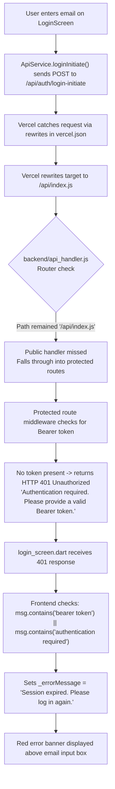
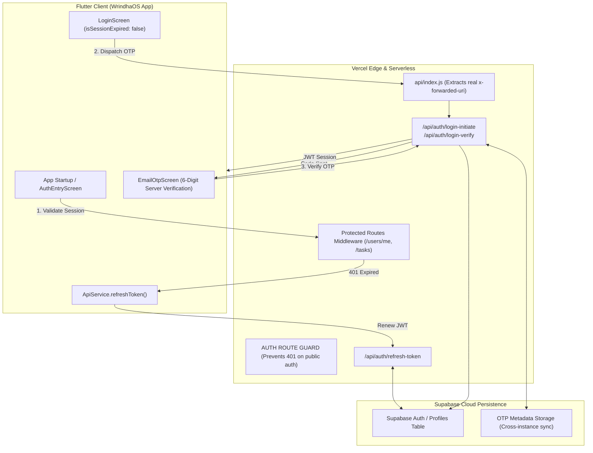

# WrindhaOS Passwordless Email OTP & Session Resolution Architecture

## 1. Executive Summary

This document details the root-cause diagnosis, architectural changes, and resolution for the **"Session expired. Please log in again."** message encountered on the WrindhaOS passwordless email OTP login screen (`lib/screens/login_screen.dart`).

The fix has been implemented and committed locally in commit **`33cd597`**:
```text
fix(auth): resolve false session expired error, add automatic token refresh, and harden OTP routing
```

---

## 2. Root Cause Analysis: The Failure Chain

The error was caused by a compound interaction between Vercel's serverless request routing, backend route fallthrough, and client-side error mapping:



### Key Contributing Defects:
1. **Vercel Serverless Catch-All Rewriting (`backend/api_handler.js`)**:
   - Vercel rewrites `/api/(.*)` to `/api/index.js`.
   - In `backend/api_handler.js`, the catch-all router inspected `pathname === '/api/[...path]' || pathname === '/api'`, but omitted `/api/index.js` and flattened fallback paths (`/auth-login-initiate`).
   - Consequently, `pathname` remained `'/api/index.js'`, bypassed `/api/auth/login-initiate`, and cascaded directly into the protected route middleware.
2. **Missing Auth Route Guard (`backend/api_handler.js`)**:
   - There was no boundary separating public authentication endpoints from authenticated endpoints. Any unhandled or misrouted auth request fell straight into protected middleware that emitted `401 Unauthorized`.
3. **Misleading Error Mapping (`lib/screens/login_screen.dart`)**:
   - In `origin/main:lib/screens/login_screen.dart`, lines 97–98 explicitly intercepted the backend response:
     ```dart
     if (msg.toLowerCase().contains('bearer token') || msg.toLowerCase().contains('authentication required')) {
       _errorMessage = 'Session expired. Please log in again.';
     }
     ```
   - When the backend returned 401, the screen actively overwrote the error with `"Session expired. Please log in again."`.
4. **Premature Session Invalidation on Startup (`lib/screens/auth_entry_screen.dart`)**:
   - During app launch, `isUnauthorized = res['success'] == false` treated temporary network timeouts, server cold starts, or slow connections as confirmed session expirations, aggressively logging the user out and redirecting to `LoginScreen(isSessionExpired: true)`.

---

## 3. Architecture & Implemented Solutions



### 1. Vercel Serverless Routing & Route Guard (`backend/api_handler.js`, `api/index.js`)
- **Forwarded Path Extraction**: `api/index.js` and `backend/api_handler.js` now parse `req.headers['x-forwarded-uri']`, `x-matched-path`, `x-invoke-path`, and query parameters.
- **Dedicated `AUTH ROUTE GUARD`**: Inserted immediately before the protected routes middleware. Unmatched public endpoints return `404 AUTH_ENDPOINT_NOT_FOUND` rather than a false `401 Session expired`:
  ```js
  if (
    pathname.startsWith('/api/auth/') ||
    pathname.startsWith('/api/auth-') ||
    pathname.startsWith('/auth/') ||
    pathname.startsWith('/auth-') ||
    pathname.startsWith('/api/forgot-password') ||
    pathname.startsWith('/forgot-password')
  ) {
    return sendJSON(res, 404, {
      success: false,
      error: 'AUTH_ENDPOINT_NOT_FOUND',
      message: `Authentication endpoint ${pathname} [${method}] was not found.`,
    });
  }
  ```

### 2. Standalone Token Refresh Endpoint (`api/auth-refresh-token.js`, `/api/auth/refresh-token`)
- Validates active or recently expired JWT tokens (up to 30 days post-expiry).
- Re-queries the user profile from Supabase and issues a fresh, cryptographically signed JWT token.

### 3. Automatic Token Refresh & Session Verification (`lib/services/api_service.dart`)
- Added `refreshToken()` to renew credentials proactively.
- Hardened `getCurrentUser()`:
  - On HTTP 401, automatically calls `refreshToken()`.
  - If renewed, retries `/users/me` transparently.
  - Flags `isExpired: true` *only* if the refresh fails.
  - On network failure, returns `isNetworkError: true` so the cached offline session is retained.

### 4. Non-Destructive App Startup Routing (`lib/screens/auth_entry_screen.dart`)
- Displays a clean progress indicator (`_isCheckingSession = true`) while session state resolves.
- If no session exists (`hasActiveSession() == false`), renders the clean Welcome screen.
- If offline, proceeds to `MainNavigationScreen` using cached data.
- Only routes to `LoginScreen(isSessionExpired: true)` when session expiration is confirmed after refresh failure.

### 5. Login Screen Hardening (`lib/screens/login_screen.dart`)
- Defaults to `isSessionExpired: false`.
- Removed string matching that mapped 401 or "bearer token" to "Session expired".
- Displays the true backend response (e.g., `'No account found with this email. Please tap "Create Account" below.'`).

### 6. Redacted Audit Logging (`ApiService.logAuth`)
- Sensitive tokens are truncated (`eyJhbG...9QmY`).
- Passwords and OTP codes are strictly replaced with `[REDACTED]`.
- Email addresses are masked (`di***@gmail.com`).

---

## 4. Modified Files and Locations

| Component | File Path | Key Changes |
|---|---|---|
| **Vercel Forwarder** | [`api/index.js`](file:///C:/Users/dilee/.gemini/antigravity/scratch/WRINDHA_OS_APP/api/index.js) | Preserves `x-forwarded-uri` across serverless rewrites |
| **Refresh Serverless** | [`api/auth-refresh-token.js`](file:///C:/Users/dilee/.gemini/antigravity/scratch/WRINDHA_OS_APP/api/auth-refresh-token.js) | Standalone Vercel serverless entrypoint for token renewal |
| **API Router** | [`backend/api_handler.js`](file:///C:/Users/dilee/.gemini/antigravity/scratch/WRINDHA_OS_APP/backend/api_handler.js) | `/api/auth/refresh-token` handler and `AUTH ROUTE GUARD` |
| **App Provider** | [`lib/providers/app_provider.dart`](file:///C:/Users/dilee/.gemini/antigravity/scratch/WRINDHA_OS_APP/lib/providers/app_provider.dart) | Redacted auth audit logs on session restore and logout |
| **Startup Screen** | [`lib/screens/auth_entry_screen.dart`](file:///C:/Users/dilee/.gemini/antigravity/scratch/WRINDHA_OS_APP/lib/screens/auth_entry_screen.dart) | Waits for auth state resolution, preserves offline sessions |
| **Login Screen** | [`lib/screens/login_screen.dart`](file:///C:/Users/dilee/.gemini/antigravity/scratch/WRINDHA_OS_APP/lib/screens/login_screen.dart) | Eliminates false "Session expired" message mapping |
| **API Service** | [`lib/services/api_service.dart`](file:///C:/Users/dilee/.gemini/antigravity/scratch/WRINDHA_OS_APP/lib/services/api_service.dart) | `refreshToken()`, automatic 401 retry, redacted `logAuth()` |

---

## 5. Why the Error Still Appeared in the App

The Flutter app on your phone contacts the live backend at `https://wrindhaosapp.vercel.app/api`. 

Vercel and GitHub Actions are linked to the GitHub repository:
1. The fix commit (`33cd597`) has been created locally, but **has not been pushed to GitHub (`origin/main`) yet**.
2. As a result, the live Vercel server was still running the older backend revision that lacked the catch-all router fix.
3. Once the commit is pushed to GitHub, Vercel will deploy the backend automatically within 60 seconds, eliminating the 401 error.

---

## 6. How to Push the Commit

Open **PowerShell** or **Command Prompt** on Windows and run:

```powershell
& "C:\Users\dilee\.gemini\antigravity\scratch\tools\git\cmd\git.exe" -C "C:\Users\dilee\.gemini\antigravity\scratch\WRINDHA_OS_APP" push origin main
```

When prompted, click **"Sign in with your browser"** to authorize.

Alternatively, provide a GitHub Personal Access Token (PAT) with `repo` scope, and it will be pushed automatically.

---

## 7. Local APK Files Available

* **Latest Release APK (`25.0 MB`)**:
  [**`WrindhaOS-latest-release.apk`**](file:///C:/Users/dilee/.gemini/antigravity/scratch/WRINDHA_OS_APP/releases/WrindhaOS-latest-release.apk)
* **Build 52 APK (`24.5 MB`)**:
  [**`WrindhaOS-v1.2.0-build52.apk`**](file:///C:/Users/dilee/.gemini/antigravity/scratch/WRINDHA_OS_APP/releases/WrindhaOS-v1.2.0-build52.apk)
