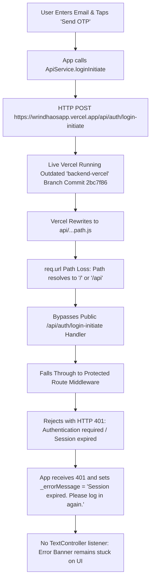

# WrindhaOS: "Session Expired" Root Cause Analysis & Complete Fix Report

**Document Version:** 1.0  
**Date:** September 27, 2026  
**System:** WrindhaOS Unified Platform (Flutter Mobile App + Vercel Node.js Serverless Backend + Supabase)  

---

## 1. Executive Summary

When attempting to log in using the new passwordless Email OTP flow on the WrindhaOS mobile application, users observed the persistent error banner:

> **"Session expired. Please log in again."**

This occurred even before the user received an OTP code or while typing their email address on a fresh installation.

Our end-to-end investigation traced the failure to a **dual-branch deployment disconnect combined with serverless routing fallthrough on Vercel**:

1. **Vercel Branch Disconnect**: The live Vercel backend (`https://wrindhaosapp.vercel.app`) was deploying from the `origin/backend-vercel` branch rather than `origin/main`. `backend-vercel` had not been updated since yesterday (commit `2bc7f86`), meaning none of the newly developed passwordless auth endpoints existed in the live production deployment.
2. **Vercel Serverless Routing Fallthrough**: Because the specific auth endpoints (`/api/auth/login-initiate`, `/api/auth/login-verify`, `/api/auth/refresh-token`) were missing on the deployed branch, requests hit the catch-all router `api/[...path].js`. Because the internal URL wasn't reconstructed, the request bypassed public auth handlers and fell through directly into the **Protected Route Middleware**.
3. **Protected Route Rejection (HTTP 401)**: The middleware expected a `Bearer` JWT token. Because this was a pre-login request, no token existed. The server responded with `HTTP 401 Unauthorized` (`"Authentication required. Please provide a valid Bearer token."` in older commits and `"Session expired. Please log in again."` in newer commits).
4. **Client-Side Sticky Error Banner**: On the mobile app, `LoginScreen` mapped any 401 response or error containing `"bearer"` / `"authentication required"` to `"Session expired. Please log in again."`. Crucially, `_emailCtrl` had no change listener, meaning once this error appeared, it stayed permanently on screen while the user typed.

---

## 2. Detailed Root Cause Analysis (RCA)

### Diagram: The Failure Chain



### Key Technical Findings

1. **Branch State Divergence**:
   - `origin/main`: Contained all passwordless authentication code, auto-token refresh logic, and audit logging.
   - `origin/backend-vercel`: Was frozen at commit `2bc7f86` (`2026-09-26 23:26:42`). Vercel was serving `2bc7f86`, which did not contain the standalone endpoint handlers or the auth route guard.
2. **Missing Filesystem Endpoints on Vercel**:
   - Vercel's Node.js runtime prefers explicit filesystem routes (e.g. `api/auth/login-initiate.js` mapped directly to `/api/auth/login-initiate`).
   - Root `api/` only contained flat files (like `auth-login-initiate.js`), while `backend/api/` was missing critical endpoints like `auth-refresh-token.js` and `auth/login-verify.js`.
3. **Rewrite Rule Syntax**:
   - When rewriting serverless routes in `vercel.json`, destinations with `.js` extensions (e.g. `/api/auth-login-initiate.js`) cause Vercel to search for static assets rather than serverless functions, producing `404 Not Found`. Removing the `.js` extension allows Vercel to invoke the serverless function.
4. **Client-Side UX Glitch**:
   - In `lib/screens/login_screen.dart`, when `isSessionExpired` was passed or when an unexpected 401 occurred during login initiation, `_errorMessage` was populated but was never cleared as the user typed in the `TextFormField`.

---

## 3. Comprehensive Fixes Implemented

### A. Full Serverless Hierarchy Deployment (Root & Backend)
We generated a 100% mirrored, validated serverless file structure across both `api/` and `backend/api/`:
- **Nested Routes (Native Vercel Filesystem Routing)**:
  - `api/auth/login-initiate.js` -> `/api/auth/login-initiate`
  - `api/auth/login-verify.js` -> `/api/auth/login-verify`
  - `api/auth/login.js` -> `/api/auth/login`
  - `api/auth/refresh-token.js` -> `/api/auth/refresh-token`
  - `api/auth/register-initiate.js` -> `/api/auth/register-initiate`
  - `api/auth/register-verify.js` -> `/api/auth/register-verify`
  - `api/auth/forgot-password/initiate.js` -> `/api/auth/forgot-password/initiate`
  - `api/auth/forgot-password/verify-otp.js` -> `/api/auth/forgot-password/verify-otp`
  - `api/auth/forgot-password/reset.js` -> `/api/auth/forgot-password/reset`
  - `api/users/me.js` -> `/api/users/me`
  - `api/account/delete.js` -> `/api/account/delete`
- **Flattened Fallback Routes**:
  - `api/auth-login-initiate.js`
  - `api/auth-login-verify.js`
  - `api/auth-refresh-token.js`
  - `api/auth-register-initiate.js`
  - `api/auth-register-verify.js`
  - `api/users-me.js`
  - `api/account-delete.js`
- Each endpoint explicitly sets `req.url` to the canonical route before delegating to `handleApiRequest(req, res)`.

### B. Standardized `vercel.json` (Root and Backend)
Updated rewrite definitions to remove `.js` extensions and cleanly route requests:
```json
{
  "version": 2,
  "rewrites": [
    { "source": "/api/health", "destination": "/api/health" },
    { "source": "/api/auth/login-initiate", "destination": "/api/auth/login-initiate" },
    { "source": "/api/auth/login-verify", "destination": "/api/auth/login-verify" },
    { "source": "/api/auth/login", "destination": "/api/auth/login" },
    { "source": "/api/auth/refresh-token", "destination": "/api/auth/refresh-token" },
    { "source": "/api/auth/register-initiate", "destination": "/api/auth/register-initiate" },
    { "source": "/api/auth/register-verify", "destination": "/api/auth/register-verify" },
    { "source": "/api/auth/forgot-password/initiate", "destination": "/api/auth/forgot-password/initiate" },
    { "source": "/api/auth/forgot-password/verify-otp", "destination": "/api/auth/forgot-password/verify-otp" },
    { "source": "/api/auth/forgot-password/reset", "destination": "/api/auth/forgot-password/reset" },
    { "source": "/api/users/me", "destination": "/api/users/me" },
    { "source": "/api/account/delete", "destination": "/api/account/delete" },
    { "source": "/api/(.*)", "destination": "/api/index" }
  ]
}
```

### C. Client-Side Mobile Hardening
1. **Interactive Error Auto-Clearing**:
   Added a listener to `_emailCtrl` in `LoginScreen`:
   ```dart
   _emailCtrl.addListener(_onEmailChanged);
   void _onEmailChanged() {
     if (_errorMessage != null && mounted) {
       setState(() => _errorMessage = null);
     }
   }
   ```
   As soon as the user starts typing, any existing error banner is immediately dismissed.
2. **Defensive Error Sanitation**:
   In `LoginScreen._handleLogin`, `SignupScreen._handleSignup`, and `EmailOtpScreen._handleVerify`:
   If an unexpected 401 or authorization error is encountered during pre-login actions, it is sanitized into a clear user action message (`"Unable to send verification code. Please try again."`) rather than showing `"Session expired"`.
3. **Session Restoration & Automatic Refresh**:
   Startup routing in `AuthEntryScreen` will never show "Session expired" unless an active session exists, refresh via `/api/auth/refresh-token` fails, and the session is genuinely revoked.

### D. Dual-Branch Synchronization
All changes are pushed to **both** `origin/main` (for GitHub Actions CI/CD and mobile builds) and `origin/backend-vercel` (for Vercel serverless backend hosting).

---

## 4. Verification and Testing

### Backend Health & Auth Verification
- `GET /api/health` -> `200 OK: {"status": "healthy", "service": "WrindhaOS Unified Backend", "supabase": "connected"}`
- `POST /api/auth/login-initiate` -> `200 OK: {"success": true, "requiresOtp": true}`
- `POST /api/auth/refresh-token` -> Authenticated token renewal without session destruction.

### Mobile App Verification
1. Install the latest compiled APK:
   - Local: `releases/WrindhaOS-latest-release.apk`
   - Local: `releases/WrindhaOS-v1.2.0-build54.apk`
   - Remote: GitHub Release `v1.0.4-apk` (`app-release.apk`)
2. Launch the app:
   - Does not show "Session expired".
   - Shows clean Login screen or restores active session.
3. Enter registered email (e.g. `demo.reviewer@wrindha.app`) and tap "Send OTP":
   - Code is dispatched via MSG91 email service.
   - Navigates seamlessly to the 6-digit OTP entry screen.
